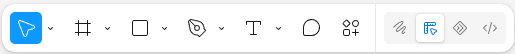

# Figma Memo

---
## 基本情報

### 基本構成

```
- Page（レイヤー）
  - Frame
    - Component
      - Variant
        - Instance
```

---
## Frame

### 基本

Figma は基本的に Frame を中心に構成されており、Frame 内に Component や Variant, Instance, その他要素を配置する。Frame はデザインのキャンバスとして機能し、レイアウトやグリッドの設定も可能。

### 作成方法

１）F を押す

２）Design パネル


３）Ctrl + Alt + G
複数オブジェクトを選択した状態で押すと、Frameにまとめられる。

---
## Component

### 基本

Component は再利用可能なデザイン要素であり、複数の Instance を作成して一貫性を保つことができる。Component を編集すると、すべての Instance に変更が反映される。

```
- Master Component
  - Variant
    - Instance
```

#### 作成方法

１）右クリックメニュー
２）Ctrl + Alt + K

#### 使用方法（Instance の作成）

Assets（アセット）パネルからドラッグ＆ドロップで作成可能。

### Override

Instance 単位での変更も可能で、これを Override と呼ぶ。
Instance の色を変更する
→ Master Component の色を変更する: Instance の色は Override されているので変更されない。
→ Master Component のサイズを変更する: Instance のサイズは Master Component の変更が反映される。

### Variant

Variant は Component のバリエーションを管理するための機能で、同じ Component の異なる状態（例: ボタンの通常状態とホバー状態）をまとめて管理できる。Component 配下に Variant を作成する。Variant が作成された Component では、いつでも Instance に適用する Variant を切り替えることができる。

#### 作成方法

１）Component を選択 > 右クリック > メインコンポーネント > バリアントの追加
２）Component を選択 > 右メニュー プロパティを追加 > バリアント

---
## Tips

### 画面スクロール（横）

１）マウスホイールを押し込みながらドラッグ
２）Spaceキーを押しながらドラッグ
３）Shiftキーを押しながらマウスホイールを回す
４）トラックパッドで二本指でスワイプ