# Mermaid 構文リファレンス

## フローチャート

**基本構文（上から下）**
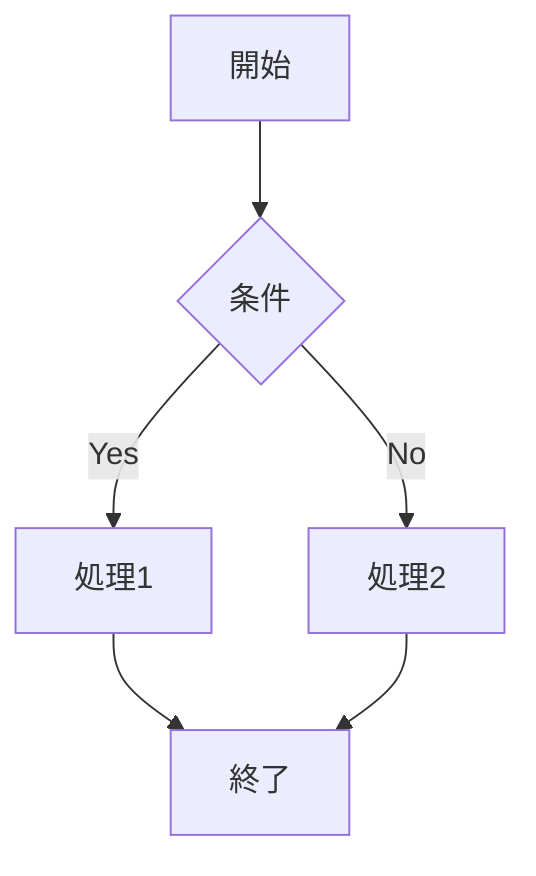

**左から右**
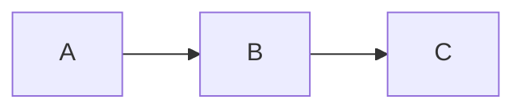

## シーケンス図

**基本構文**
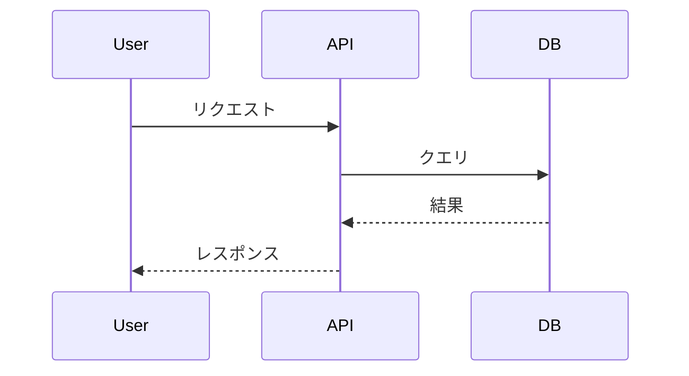

**活性化表示**
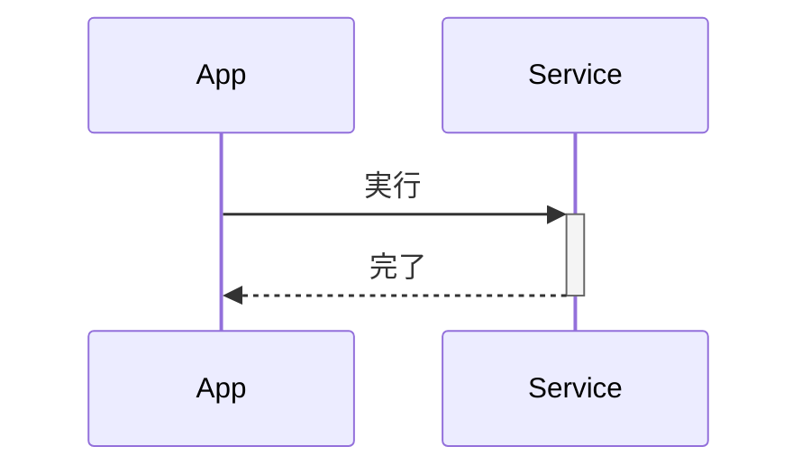

## クラス図

**基本構文**
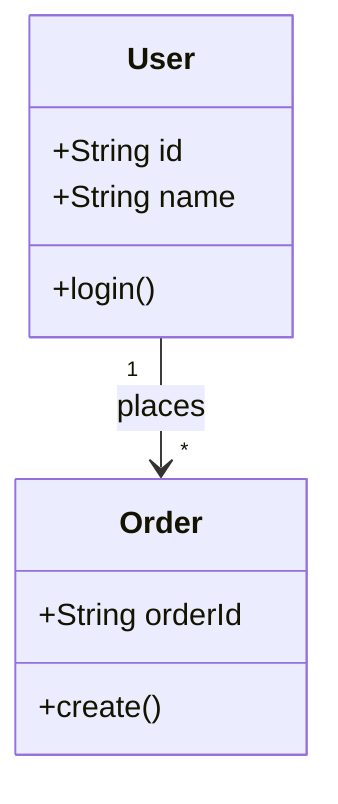

## ER 図

**基本構文**
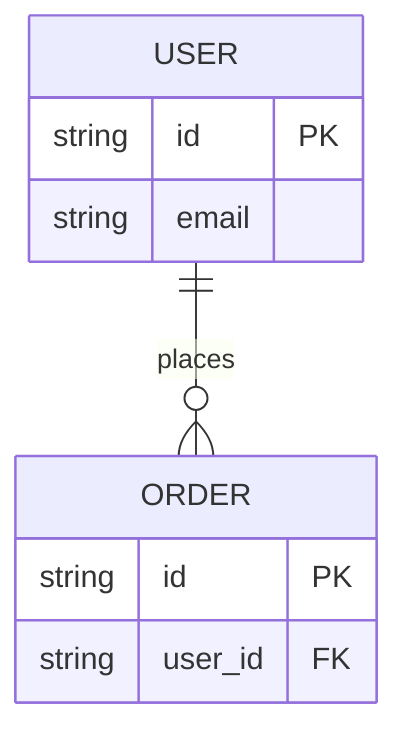

## 状態遷移図

**基本構文**
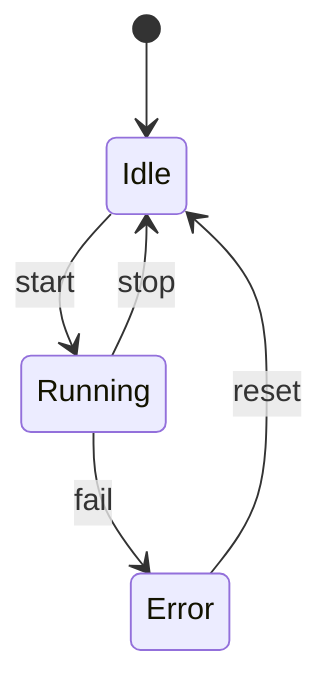

## ガントチャート

**基本構文**
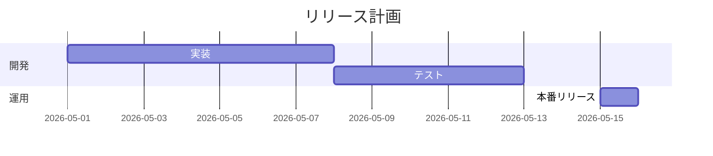

## 円グラフ

**基本構文**
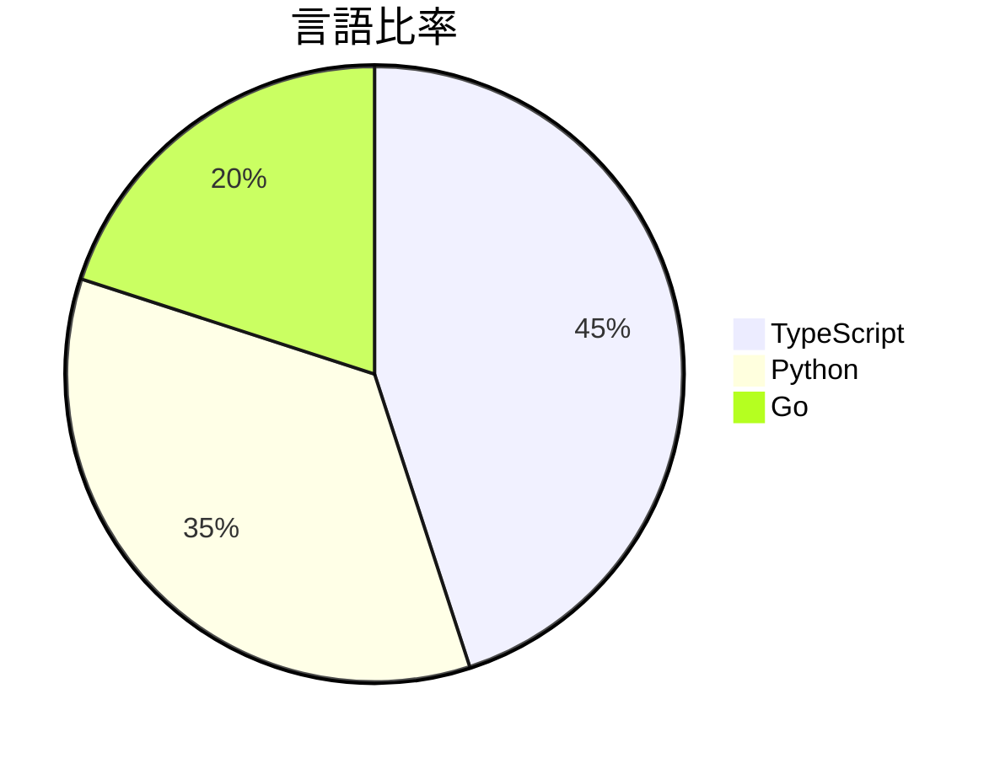

## サブグラフ

**グルーピング**
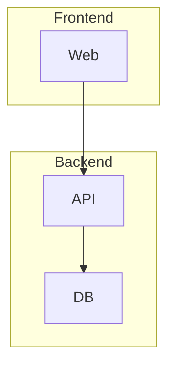

## スタイル指定

**ノード色・枠線変更**
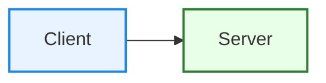

**classDef で再利用**
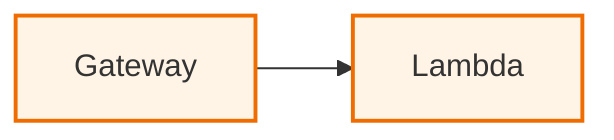

## コメント

**行コメント**
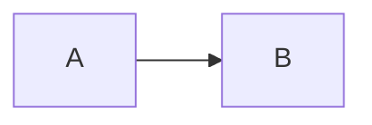

## 使い分けの目安

- 処理手順: フローチャート
- API の時系列: シーケンス図
- モデル設計: クラス図 / ER 図
- ライフサイクル: 状態遷移図
- スケジュール: ガントチャート
