# PlantUML (PUML) 構文リファレンス

## 基本

**最小構成**
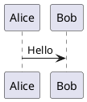

**タイトルと注釈**
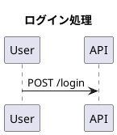

## シーケンス図

**基本構文**
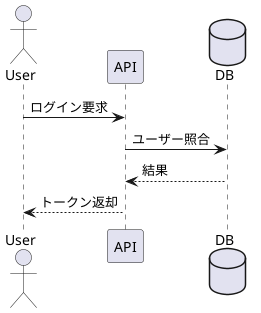

**条件分岐**
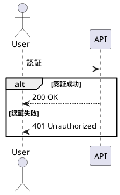

## ユースケース図

**基本構文**
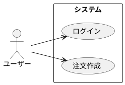

## クラス図

**基本構文**
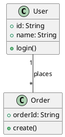

## アクティビティ図

**基本構文**
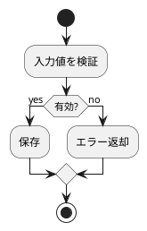

## ステート図

**基本構文**
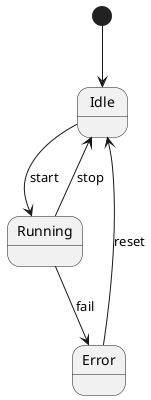

## コンポーネント図

**基本構文**
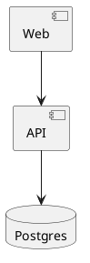

## ER 風表現（IE記法）

**エンティティ関係**
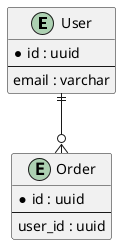

## スキン・見た目

**テーマ適用**
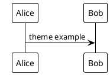

**色指定**
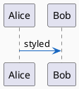

## コメント

**1行コメント**
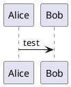

**複数行コメント**

## 使い分けの目安

- UML 全般を厳密に記述: PlantUML
- Markdown 上で手軽に可視化: Mermaid
- 複雑な相互作用の詳細化: PlantUML シーケンス図
